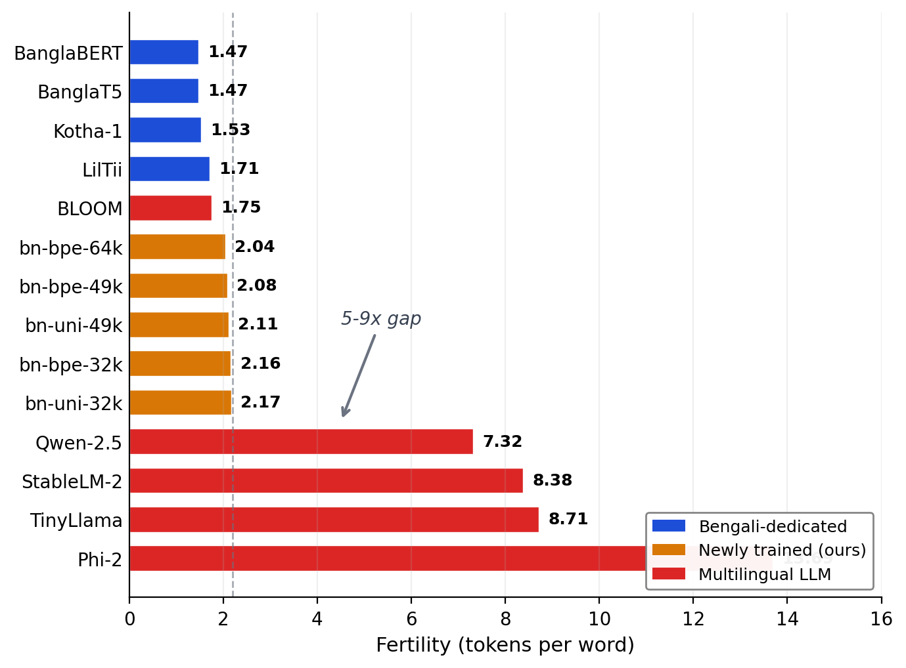

# Subword Tokenization Efficiency for Bengali Language Modeling

A research release on a problem that is easy to overlook but expensive to ignore: tokenizer choice can change Bengali context efficiency by 5-9x.

This repository packages the paper, evaluation code, trained tokenizers, and release artifacts for:

**"Subword Tokenization Efficiency and Unicode Failure Modes in Bengali Language Modeling"**  
Shifat Islam Santo, The University of Texas at Dallas

[Paper (PDF)](paper/paper.pdf)

## What is in this repo

- `paper/`: LaTeX source and compiled PDF
- `scripts/`: tokenizer training and evaluation code
- `configs/`: example commands for paper-style runs
- `trained_tokenizers/`: 13 released SentencePiece models
- `results/`: frozen evaluation artifacts and release notes
- `figures/`: plots used in the paper
- `docs/`: notes on dataset format and reconstruction

## Key findings

- Bengali-dedicated tokenizers (1.47-1.75 tokens/word) are much more efficient on Bengali text than most multilingual LLM tokenizers (7.32-13.69 tokens/word).
- A single missing combining character, U+09BC Bengali Nukta, explains most byte-fallback inflation in the affected tokenizer runs.
- BLOOM is a notable multilingual exception and remains competitive on Bengali because of stronger script coverage.

## Why this is worth releasing

- It turns a vague intuition into a measurable systems result: Bengali tokenization quality directly affects context capacity, training efficiency, and inference cost.
- It covers a real gap in the open literature and tooling ecosystem: Bengali tokenizers are widely used, but side-by-side efficiency evidence is rare.
- It is useful beyond the paper itself: the repo includes reusable evaluation code, 13 trained SentencePiece models, figures, and a portable comparison workflow.
- It gives other researchers and builders something concrete to audit, extend, cite, and compare against instead of starting from scratch.



## Trained tokenizers

The repository ships 13 SentencePiece tokenizers:

| Name | Algorithm | Vocab | Data mix |
|------|-----------|-------|----------|
| bn-bpe-16k | BPE | 16K | Bengali |
| bn-bpe-32k | BPE | 32K | Bengali |
| bn-bpe-49k | BPE | 49K | Bengali |
| bn-bpe-64k | BPE | 64K | Bengali |
| bn-uni-16k | Unigram | 16K | Bengali |
| bn-uni-32k | Unigram | 32K | Bengali |
| bn-uni-49k | Unigram | 49K | Bengali |
| bn-uni-64k | Unigram | 64K | Bengali |
| mix-bpe-32k | BPE | 32K | Bengali+English |
| mix-bpe-49k | BPE | 49K | Bengali+English |
| mix-bpe-64k | BPE | 64K | Bengali+English |
| mix-uni-32k | Unigram | 32K | Bengali+English |
| mix-uni-49k | Unigram | 49K | Bengali+English |

The paper table evaluates a curated subset of these models plus external baselines such as Kotha-1, LilTii, BanglaBERT, BLOOM, Qwen, TinyLlama, Phi-2, and StableLM-2. The extra released tokenizer variants are kept here as exploratory artifacts.

## Setup

The scripts were smoke-tested with Python 3.10+.

```bash
python -m venv .venv
source .venv/bin/activate
pip install -r requirements.txt
```

## Reproducing the released artifacts

### 1. Train the released SentencePiece tokenizers

```bash
python scripts/train_all_tokenizers.py \
  --bn-corpus /path/to/bengali.jsonl \
  --en-corpus /path/to/english.jsonl \
  --output-dir trained_tokenizers \
  --sample-gb 1.5
```

### 2. Evaluate your trained models

```bash
python scripts/evaluate_tokenizers.py \
  --eval-data /path/to/eval.jsonl \
  --trained-dir trained_tokenizers \
  --output results/eval.json \
  --max-docs 3000 \
  --min-chars 200 \
  --skip-hf
```

### 3. Run a paper-style comparison

The evaluator is now portable: local baselines must be passed explicitly instead of relying on hard-coded paths.

Use the example driver in `configs/paper_eval.example.sh` as a starting point for reproducing the paper comparison on your own machine.

## Evaluation data

The 3,000-document evaluation set is not bundled directly in this repository. The current repo release includes:

- the expected JSONL schema
- the document filtering rules used by the scripts
- the corpus provenance and reconstruction notes

See [docs/evaluation_data.md](docs/evaluation_data.md) for the details.

## Results and artifact notes

`results/full_eval.json` is a frozen release artifact kept for transparency. It was generated before the evaluator CLI was cleaned up, so treat it as a checked-in reference file rather than as the exact output schema promised by the current script version.

See [results/README.md](results/README.md) for provenance notes and caveats.

## Launch assets

Ready-to-post repo copy, release text, and thread drafts live in [docs/launch-kit.md](docs/launch-kit.md).

## Bottom line

If you work on Bengali language modeling, continued pretraining, tokenizer design, or multilingual evaluation, this repo is already useful in its current form. It makes an important empirical point, ships reusable artifacts, and creates a stronger public baseline than leaving the work unpublished.

## Citation

```bibtex
@article{santo2026bengali,
  title={Subword Tokenization Efficiency and Unicode Failure Modes in Bengali Language Modeling},
  author={Santo, Shifat Islam},
  journal={arXiv preprint},
  year={2026}
}
```

## License

MIT
